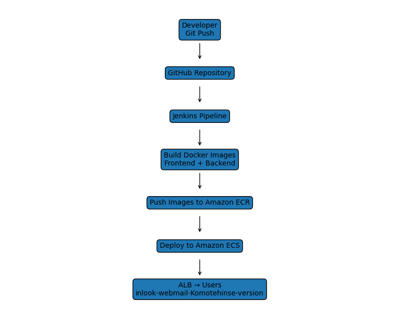

# inlook-webmail-Komotehinse-version

## Enterprise Cloud-Native Webmail Platform

inlook-webmail-Komotehinse-version is a full-stack cloud-native webmail application designed and deployed using modern AWS Cloud Engineering and DevOps practices.

The project demonstrates Infrastructure as Code (IaC), containerization, CI/CD automation, cloud security, monitoring, logging, and scalable application deployment using AWS services.

The architecture follows enterprise cloud design principles and showcases skills commonly used by Cloud Engineers, DevOps Engineers, Platform Engineers, and Site Reliability Engineers (SREs).

---

# Project Objectives

This project was built to demonstrate:

* AWS Cloud Infrastructure Deployment
* Terraform Infrastructure as Code (IaC)
* Docker Containerization
* Jenkins CI/CD Automation
* Amazon ECS Container Orchestration
* Amazon ECR Container Registry
* Application Load Balancer (ALB)
* Amazon RDS Database Services
* Amazon S3 Storage Services
* Cloud Security Monitoring
* Application Monitoring & Observability
* Infrastructure Automation

---

# Application Features

## User Features

* User Registration
* User Authentication
* Login / Logout
* Inbox Management
* Sent Mail Management
* Draft Management
* Email Composition
* User Profile Management
* File Attachment Support
* Cloud Storage Integration

---

# AWS Services Used

## Networking

* Amazon VPC
* Public Subnets
* Private Subnets
* Internet Gateway
* Route Tables
* Security Groups

## Compute

* Amazon ECS Fargate
* ECS Services
* ECS Task Definitions

## Container Registry

* Amazon ECR

## Load Balancing

* Application Load Balancer (ALB)

## Database

* Amazon RDS MySQL

## Storage

* Amazon S3

## Monitoring

* Amazon CloudWatch
* Prometheus
* Grafana

## Security

* AWS GuardDuty
* AWS Security Hub
* IAM Roles
* IAM Policies
* Permission Boundaries

## CI/CD

* Jenkins
* Docker
* GitHub

---

# Architecture Diagram


---

# Deployment Flow



---

# High-Level Architecture

Users access the application through an Application Load Balancer (ALB).

The ALB routes traffic to Amazon ECS services running containerized frontend and backend workloads.

Frontend services are built using React and communicate with backend APIs built using Node.js.

Application containers are stored within Amazon ECR and deployed automatically through Jenkins CI/CD pipelines.

User files and email attachments are stored in Amazon S3.

Application data is stored in Amazon RDS.

Monitoring data is collected through Prometheus, Grafana, and CloudWatch.

Security findings are monitored through GuardDuty and Security Hub.

---

# Repository Structure

```text
inlook-aws-project-pro-version/

├── app
│   ├── backend
│   └── frontend
│
├── bootstrap
│
├── docs
│
├── jenkins
│
├── monitoring
│   ├── grafana
│   └── prometheus
│
├── terraform
│   ├── environments
│   │   ├── dev
│   │   ├── qa
│   │   ├── test
│   │   └── prod
│   │
│   ├── modules
│   │   ├── networking
│   │   ├── load-balancing
│   │   ├── compute
│   │   ├── database
│   │   ├── devops
│   │   └── security-monitoring
│   │
│   ├── policies
│   └── scripts
│
└── README.md
```

---

# Terraform Modules

## Networking Module

Creates:

* VPC
* Public Subnets
* Private Subnets
* Route Tables
* Internet Gateway
* Security Groups

## Load Balancing Module

Creates:

* Application Load Balancer
* Target Groups
* ALB Listeners

## Compute Module

Creates:

* ECS Cluster
* ECS Task Definitions
* ECS Services

## Database Module

Creates:

* Amazon RDS MySQL Database

## DevOps Module

Creates:

* Amazon ECR Repositories
* Jenkins EC2 Instance
* IAM Roles
* IAM Policies

## Security Monitoring Module

Creates:

* CloudWatch Log Groups
* GuardDuty Detector
* Security Hub Configuration

---

# CI/CD Pipeline

The deployment process follows a fully automated CI/CD workflow.

```text
Developer
    ↓
Git Push
    ↓
GitHub Repository
    ↓
Jenkins Pipeline
    ↓
Docker Build
    ↓
Amazon ECR
    ↓
Amazon ECS
    ↓
Application Load Balancer
    ↓
End Users
```

Pipeline stages:

1. Checkout Source Code
2. Build Frontend Image
3. Build Backend Image
4. Authenticate to ECR
5. Push Images to ECR
6. Update ECS Services
7. Deploy New Application Version
8. Verify Deployment

---

# Monitoring and Observability

## Prometheus

Collects:

* Application Metrics
* ECS Metrics
* Container Metrics
* Infrastructure Metrics

## Grafana

Provides dashboards for:

* CPU Usage
* Memory Utilization
* ECS Health
* Application Availability
* Request Monitoring

## CloudWatch

Provides:

* Log Aggregation
* Infrastructure Monitoring
* Service Monitoring
* Alerting

---

# Security Controls

Security is implemented using multiple AWS services.

## AWS GuardDuty

Provides:

* Threat Detection
* Malicious Activity Monitoring
* Anomaly Detection

## AWS Security Hub

Provides:

* Security Findings Aggregation
* Security Compliance Monitoring
* Best Practice Validation

## IAM Controls

Implements:

* Least Privilege Access
* Role-Based Access Control (RBAC)
* IAM Permission Boundaries

---

# Deployment Instructions

## Bootstrap Terraform Backend

```bash
cd bootstrap

terraform init
terraform plan
terraform apply
```

---

## Deploy Development Environment

```bash
cd terraform/environments/dev

terraform init
terraform plan
terraform apply
```

---

## Destroy Environment

```bash
terraform destroy
```

---

# Monitoring Access

Prometheus:

```text
http://PROMETHEUS-IP:9090
```

Grafana:

```text
http://GRAFANA-IP:3000
```

Jenkins:

```text
http://JENKINS-IP:8080
```

---

# Skills Demonstrated

## Cloud Engineering

* AWS Architecture Design
* Networking
* Security
* Monitoring
* High Availability

## DevOps

* CI/CD
* Jenkins
* Docker
* ECS
* ECR

## Infrastructure as Code

* Terraform
* Modular Design
* Environment Separation

## Observability

* Prometheus
* Grafana
* CloudWatch

## Security Engineering

* GuardDuty
* Security Hub
* IAM
* Permission Boundaries

---

# Future Enhancements

* Multi-AZ RDS Deployment
* Auto Scaling ECS Services
* AWS WAF Integration
* Route53 Custom Domain
* HTTPS via ACM
* SNS Alerting
* CloudWatch Alarms
* Blue/Green Deployments

---

# Author

**Mayor Komotehin**

Cloud Engineer | DevOps Engineer | AWS | Terraform | Docker | Kubernetes | Jenkins | Prometheus | Grafana

Project:

**inlook-webmail-Komotehinse-version**
